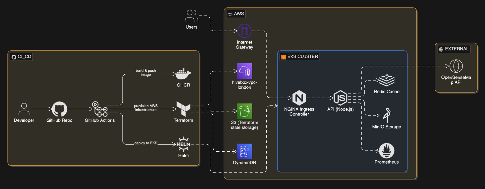

# HiveBox Global Temperature API

HiveBox is a cloud-native Node.js application that aggregates global environmental sensor data from the OpenSenseMap API, processes temperature readings, and exposes them via REST APIs.

It demonstrates modern backend engineering + DevOps practices, including containerisation, Kubernetes deployment, CI/CD automation, observability, and AWS cloud infrastructure.

📌 Architecture diagram:  

---

# Features

- REST API (Express.js)
- Global temperature aggregation (OpenSenseMap)
- Redis / Valkey caching layer
- Prometheus metrics endpoint
- Scheduled data archiving (cron jobs)
- S3-compatible storage (MinIO)
- Docker containerisation
- Kubernetes + Helm deployment
- GitHub Actions CI/CD pipeline
- Amazon EKS deployment
- Health & version endpoints

---

# Architecture Overview

Users → HiveBox API (Node.js)

API integrates with:
- OpenSenseMap API
- Redis Cache
- MinIO Storage
- Prometheus Metrics

CI/CD Pipeline:
GitHub Actions → Docker → GHCR → Helm → Amazon EKS

---

# Tech Stack

## Backend
- Node.js
- Express.js

## DevOps / Cloud
- Docker
- Kubernetes
- Helm
- AWS EKS
- Terraform
- GitHub Actions
- GHCR (GitHub Container Registry)

## Observability
- Prometheus

## Storage & Cache
- Redis / Valkey
- MinIO (S3-compatible)

---

# API Endpoints

| Endpoint     | Description                          |
|--------------|--------------------------------------|
| `/temperature` | Global average temperature (24h)   |
| `/metrics`     | Prometheus metrics endpoint        |
| `/version`     | Application version info            |
| `/store`       | Archive data to object storage     |

---

# CI/CD Pipeline

1. Install & test application  
2. Build Docker image  
3. Push image to GHCR  
4. Deploy to Amazon EKS using Helm  

---

# Deployment

- Infrastructure: Terraform (AWS)
- Application: Helm on EKS
- Observability: Prometheus

---

# Author

Abdullahi Mohamed Mohamoud  
Computer Science Graduate — Queen Mary University of London